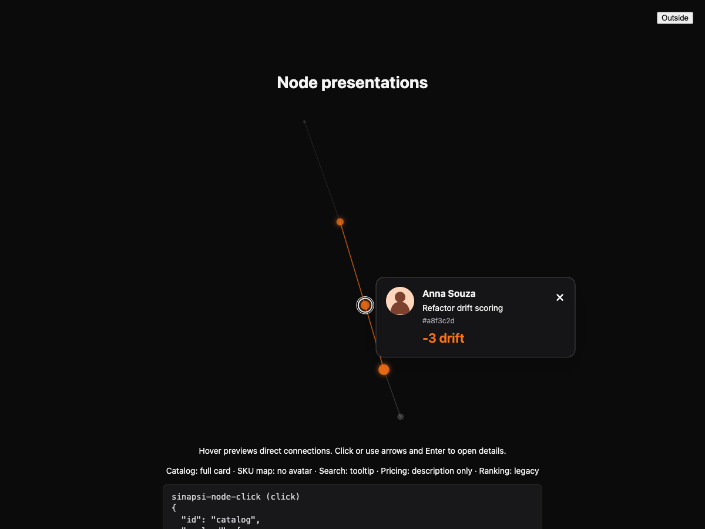
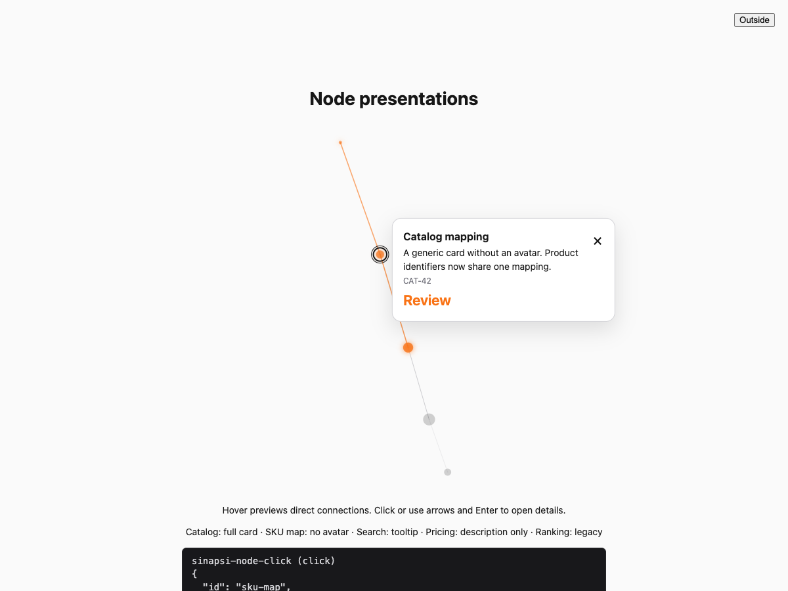
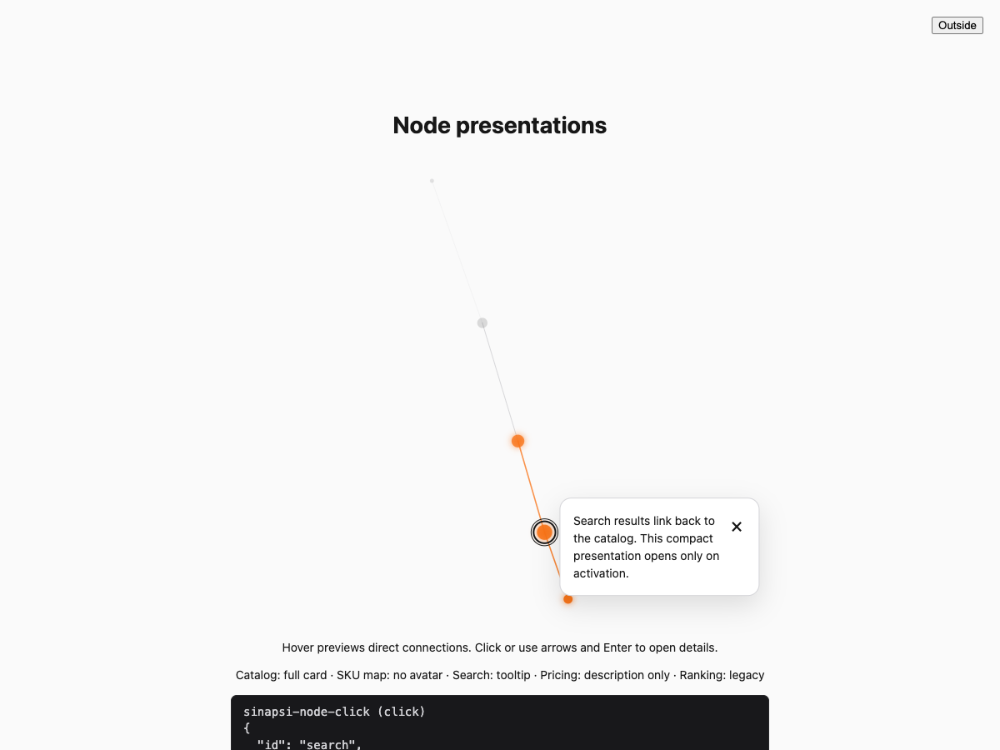

# Node presentations — Sinapsi 0.2.0

Nodes can now provide an optional `SinapsiNodePresentation`: a card with optional
title, description, avatar, reference and badge, or a compact description tooltip.
Hover and keyboard focus preview only the immediate neighborhood. Activation opens
one presentation per instance and preserves the existing click event and payload.

The implementation uses HTML inside the closed shadow root, with a manual popover
and an absolute-position fallback. The presentation follows the exact projected
coordinates painted by the renderer. Canvas rendering, hit testing and presentation
placement share the same frame; there is no React dependency or extra animation loop.

Closing with Escape, the close button, another activation, canvas background or an
outside click clears the presentation selection. External clicks preserve external
focus. Content-only updates preserve layout and selection. Nodes without a
presentation retain their legacy click display. Edges are activated only when they
are incident to the active node, including in legacy graphs.

Semantic graphs are centered and uniformly fitted within the viewport with an
adaptive margin of approximately 24 CSS pixels. This prevents excessive empty
canvas space without clipping the graph; the existing two-beat pulse remains within
the fitted envelope. Decorative graphs retain their previous layout.

## Public contract and implementation

- `src/domain/kernel/nodes.types.ts` and `src/domain/schemas/nodes.schema.ts`:
  exported union, textual-content validation, safe avatar URLs and serialization.
- `src/factories/element-class.factory.ts`: independent hover, focus, selection,
  presentation, keyboard and pointer interactions; localized `close-label`.
- `src/factories/shadow-tree.factory.ts` and `src/factories/index.css`: accessible
  nonmodal details group, live announcements, focus controls and theme parts.
- `src/services/presentation.service.ts` and `src/core/scene/`: HTML content,
  cached geometry, stable placement, clipping fallback and viewport fitting.
- `src/services/animation.service.ts`, `scene.service.ts` and `renderer.service.ts`:
  shared final projection, exact incident edges and distinct focus/selection marks.
- `README.md`, `sandbox/` and `CHANGELOG.md`: consumer API, generic examples,
  framework compatibility and release notes.

## Verification

All checks below passed against the final implementation:

- 111 automated tests across 25 files, covering schema, serialization, invalid
  updates, interaction state, edge activation, fitting, placement and lifecycle.
- Source and test TypeScript checks; scoped Biome lint; standard and standalone
  bundles and declaration generation; package payload inspection.
- Nine real Chromium CDP scenarios: keyboard opening and Tab order, optional
  fields and content updates, focus previews, toggle/legacy behavior, offscreen
  focus restoration, outside dismissal, moving-anchor alignment at DPR 2, and
  trusted touch activation versus a scroll gesture.
- Independent browser checks: Popover API disabled in a 320×320 host, two
  instances with unique IDs and scoped Escape, long scrollable content, avatar
  failure and reduced-motion stability.

Run the vanilla sandbox with `./node_modules/.bin/vite sandbox --config
vite.config.ts`. The browser suite accepts an existing dedicated Chromium session:

```sh
node test/browser-presentations.mjs '<browser-cdp-websocket>' http://127.0.0.1:5174
```

This suite replaces the sandbox fixture and instruments canvas output to compare
the moving selected node with its popup. It is intended for a dedicated test tab.
It is evidence for geometry and interaction, not a substitute for screen-reader
testing. Safari, Firefox, assistive technology and physical touch devices were not
verified. Touch coverage used trusted browser input emulation.

Repository audit and agent-scaffold checks were deliberately excluded at the
owner's request during their restructuring. CI runs the package checks directly;
the harness workflow is manual during this period. Release is also manual so that
merging this change does not publish to npm. The owner will publish version 0.2.0.

## Captures

The sandbox intentionally uses a small mixed fixture to expose all three modes.






